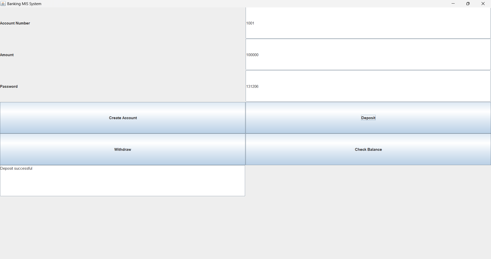

# Banking-MIS-java

A Java-based Banking Management Information System developed using Swing GUI and Object-Oriented Programming principles.

## Features
- Create bank accounts
- Deposit money
- Withdraw money
- Check account balance
- Password authentication
- GUI interface using Java Swing

## Technologies Used
- Java
- Swing (GUI)
- Object-Oriented Programming
- HashMap for account storage

## How to Run

Compile the program:

javac BankingGUI.java

Run the program:

java BankingGUI

## Application Interface

